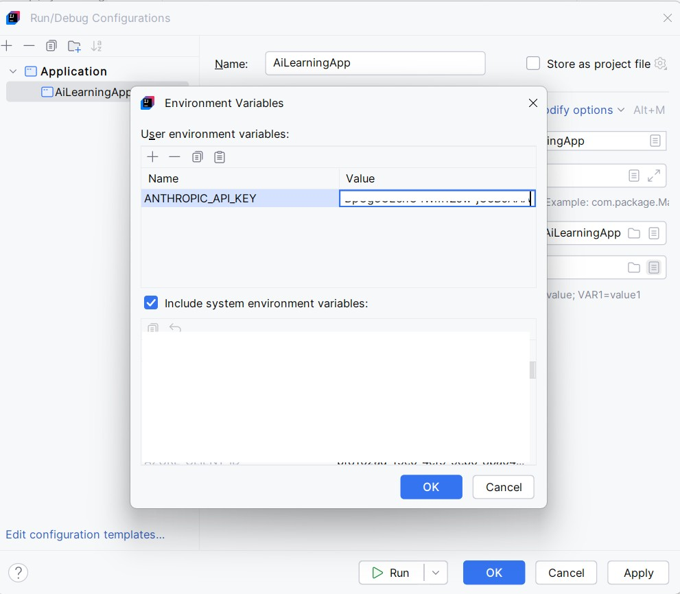

# AiLearningApp
Springboot Application containing code for learning AI concepts. Consist of usage of spring AI and dedicated AI SDK usage.

## Set up Anthropic API Key for running the application
Add/update run configuration and add user environment variable "ANTHROPIC_API_KEY"

